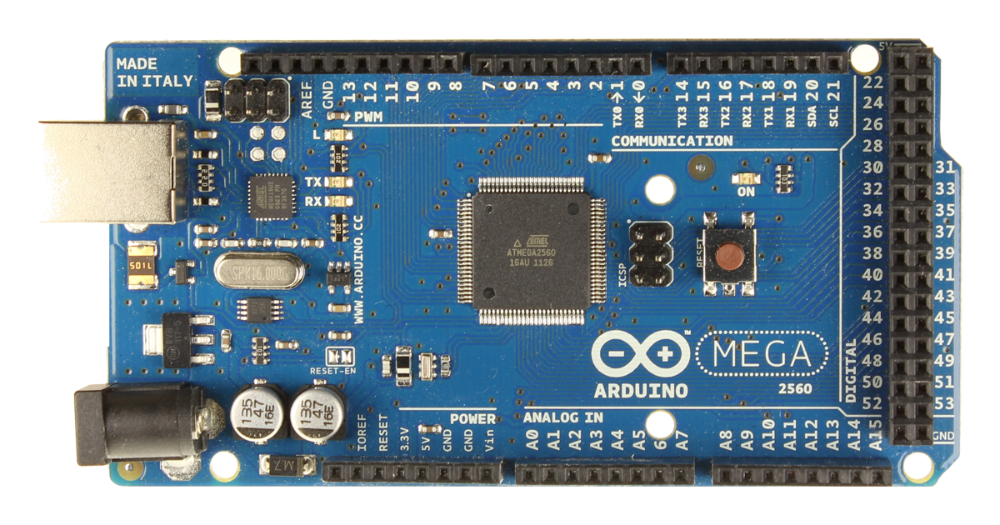
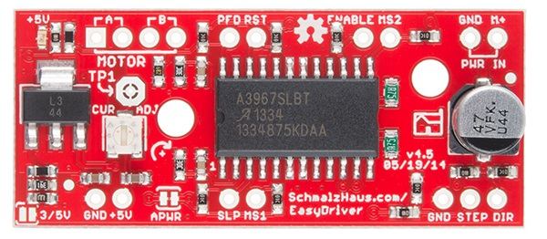
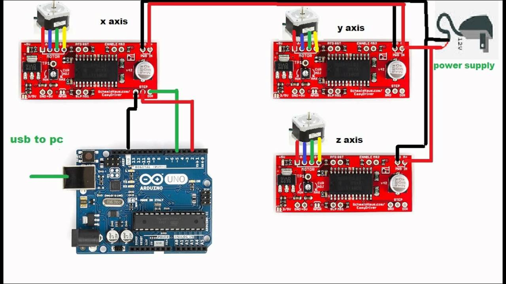

# Blast Gate project - Arduino Mega 2560

This script controls the opening and closing of dust collection blast gates
using stepper motors, flexible couplings, ACME lead screws, and ACME lead screw nuts.

Motors: Stepper Motor Nema 17 Bipolar 40mm 64oz.in(45Ncm) 2A 4 Lead 3D
Control Board: Gikfun EasyDriver Shield Stepper Motor Driver V44 A3967 For Arduino EK1204

## Wiring for Arduino Mega 2560

Connections and cabling will be made using RJ45 and RJ11 ports.

### Arduino Mega Pinouts

|            | AccelStepper Pin1 | AccelStepper Pin2 | TogglePin | SleepPin   |
|------------|-------------------|-------------------|-----------|------------|
| Motor 1    | 52                | 50                | 48        | 46         |
| Motor 2    | 44                | 42                | 40        | 38         |
| Motor 3    | 36                | 34                | 32        | 30         |
| Motor 4    | 28                | 26                | 24        | 22         |
| Motor 5    | 53                | 51                | 49        | 47         |
| Motor 6    | 45                | 43                | 41        | 39         |
| Motor 7    | 37                | 35                | 33        | 31         |
| Motor 8    | 29                | 27                | 25        | 23         |
| Wire Color | Green             | Green/White       | Blue      | Blue/White |

#### AccelStepper Pins

**Pin1:** Arduino digital pin number for motor pin 1. Defaults to pin 2. For a AccelStepper::DRIVER (interface==1), this is the Step input to the driver. Low to high transition means to step)

**Pin2:** Arduino digital pin number for motor pin 2. Defaults to pin 3. For a AccelStepper::DRIVER (interface==1), this is the Direction input the driver. High means forward.

### Stepper Motor Pinouts

|            | A+  | A-   | B+    | B-     |
|------------|-----|------|-------|--------|
| Wire Color | Red | Blue | Green | Yellow |

### EasyDriver Pinout

|            | 12v GND     | 12v M+ | GND         | STEP  | DIR         | SLP        |
|------------|-------------|--------|-------------|-------|-------------|------------|
| Wire Color | Orange/White| Orange | Brown/White | Green | Green/White | Blue/White |

### Ethernet RJ45 Pinouts

|             | Motor Pin1 | Motor Pin2  | Toggle | Sleep      | 12v +  | 12v GND      | N/A   | Arduino GND |
|-------------|------------|-------------|--------|------------|--------|--------------|-------|-------------|
| Wire Color  | Green      | Green/White | Blue   | Blue/White | Orange | Orange/White | Brown | Brown/White |
| Port Number | 1          | 2           | 3      | 4          | 5      | 6            | 7     | 8           |

### Ethernet RJ11 Pinouts

Use outside two pins. Wire one to EasyDriver GND and other to Blue on ethernet.

## Images

### Arduino Mega 2560

### EasyDriver Shield

### Sample Stepper Motor Wiring Diagram

## Resources

* http://www.airspayce.com/mikem/arduino/AccelStepper/annotated.html
* https://brainy-bits.com/blogs/tutorials/setting-stepper-motors-home-position-using-accelstepper
* https://brainy-bits.com
